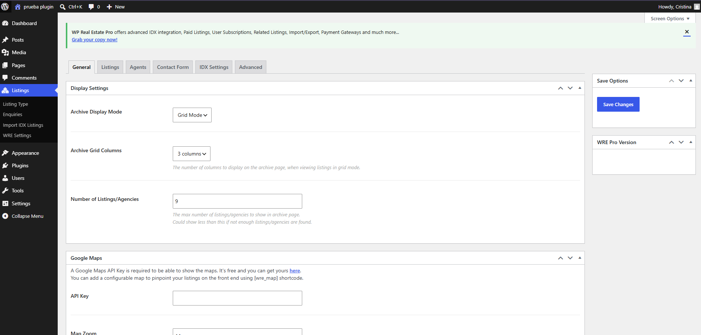
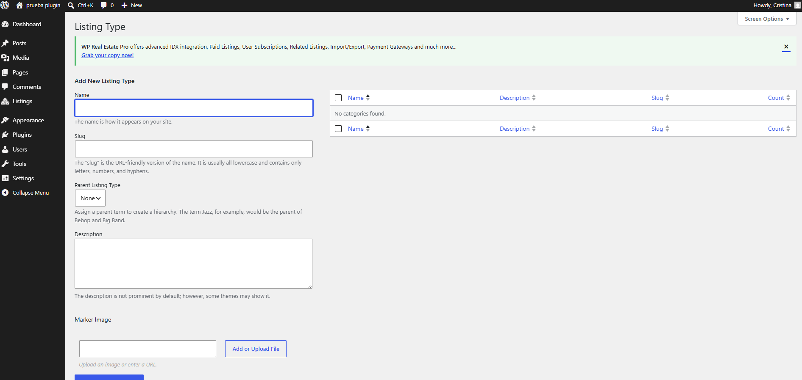
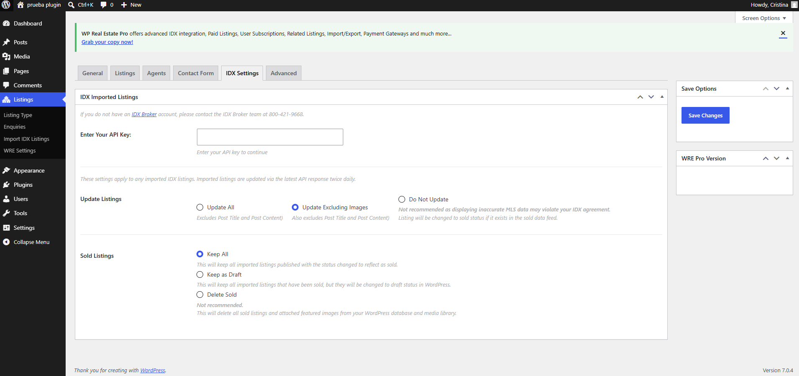

# WP Real Estate

**Plugin de WordPress para la gestión completa de una inmobiliaria**: fichas de inmuebles, directorio de agentes, taxonomías configurables, panel de ajustes por pestañas y un generador de contenido de demostración con imágenes reales importadas desde Unsplash.


---

## Índice

- [¿Qué hace este plugin?](#qué-hace-este-plugin)
- [Características principales](#características-principales)
- [Capturas de pantalla](#capturas-de-pantalla)
- [Tecnologías](#tecnologías)
- [Estructura del proyecto](#estructura-del-proyecto)
- [Instalación](#instalación)
- [Primeros pasos](#primeros-pasos)
- [Desinstalación](#desinstalación)
- [Changelog](#changelog)
- [Licencia](#licencia)

---

## ¿Qué hace este plugin?

WP Real Estate añade a WordPress todo lo necesario para publicar y gestionar un catálogo inmobiliario:

- Dos tipos de contenido propios: **Inmuebles** y **Agentes**.
- Un sistema de **taxonomías** para clasificar cada inmueble (tipo, operación, ubicación, comodidades, estado, certificado energético).
- **Fichas de datos completas** para inmuebles (precio, superficies, ubicación, referencias, disponibilidad, galería) y agentes (contacto, datos profesionales, redes sociales).
- Un **panel de administración** propio, con ajustes organizados en pestañas.
- Un **generador de contenido de demostración** que crea agentes e inmuebles realistas —con fotos reales traídas desde la API de Unsplash— para poder ver el plugin funcionando en segundos, sin dar de alta nada a mano.

Todo pensado para servir de base sólida a un theme o a un desarrollo a medida de sitio inmobiliario.

## Características principales

### 🏠 Inmuebles (`wpre_listing`)

CPT con archivo público (`/inmuebles/`) y ficha de datos con más de 20 campos agrupados por bloques:

| Grupo | Campos |
|---|---|
| Precio | Precio, precio anterior, etiqueta de precio, moneda |
| Dimensiones | Superficie construida/útil/parcela, habitaciones, baños, plantas, número de piso, año de construcción, orientación |
| Ubicación | Dirección, código postal, ciudad, latitud/longitud |
| Referencias | Referencia interna, referencia catastral |
| Estado | Disponibilidad (disponible, reservada, vendida, alquilada, retirada) |
| Multimedia | Galería de imágenes, plano |
| Asignación | Agente responsable del inmueble |

### 🧑‍💼 Agentes (`wpre_agent`)

CPT con archivo público (`/agentes/`) y ficha con datos de contacto, información profesional (licencia, años de experiencia, idiomas, cargo) y enlaces a redes sociales (Facebook, Instagram, LinkedIn, Twitter/X, WhatsApp).

### 🏷️ Taxonomías

- **Tipo de inmueble** (jerárquica) — piso, casa, chalet, local...
- **Tipo de operación** — venta, alquiler, alquiler vacacional
- **Ubicación** (jerárquica) — país, provincia, ciudad, barrio
- **Comodidades** — etiquetas tipo "no jerárquica" (ascensor, piscina, garaje...)
- **Estado del inmueble** — obra nueva, buen estado, a reformar...
- **Certificado energético**
- **Especialidad del agente**

### ⚙️ Panel de administración

Menú propio ("WP Real Estate") con:

- **Panel**: resumen con el número de inmuebles/agentes publicados y accesos rápidos.
- **Ajustes** (vía Settings API de WordPress, en pestañas): datos de la empresa, redes sociales, configuración (moneda, unidad de medida, inmuebles por página, clave de Google Maps) y horarios.
- **Herramientas**: generador/eliminador de contenido de demostración.
- Columnas personalizadas y ordenables en los listados de Inmuebles y Agentes (precio, ciudad, agente, etc.).

### 🪄 Generador de contenido de demostración

Un asistente paso a paso (AJAX, con barra de progreso) que crea **8 agentes y 50 inmuebles** repartidos en 10 tipologías distintas (apartamentos, casas, chalets, áticos, locales, oficinas, terrenos, estudios, dúplex, naves), con textos realistas y fotos importadas automáticamente desde **Unsplash** si se configura una API key. Todo el contenido de demo queda marcado internamente para poder eliminarlo por completo con un clic, sin dejar rastro en la base de datos.

## Capturas de pantalla

<table>
<tr>
<td width="50%">

**Ajustes generales** — pestaña de configuración con el modo de visualización del archivo de inmuebles, columnas de la cuadrícula, número de elementos por página y la clave de la API de Google Maps para mostrar mapas en las fichas.



</td>
<td width="50%">

**Gestión de taxonomías** — alta de un nuevo término en la taxonomía *Tipo de Inmueble*, con nombre, slug, término padre (soporta jerarquía) y descripción, igual que el resto de taxonomías que registra el plugin.



</td>
</tr>
</table>

**Navegación por pestañas del panel de ajustes** — el mismo patrón de `nav-tab-wrapper` de WordPress que usa la pantalla *Ajustes* de WP Real Estate para organizar General, Redes Sociales, Configuración y Horarios.



## Tecnologías

- **PHP 8.0+** con tipado estricto (`match`, `mixed`, tipos de retorno) y namespaces PSR-4 (`WPRealEstate\`).
- **WordPress Plugin API**: Custom Post Types, taxonomías, meta boxes, [Settings API](https://developer.wordpress.org/plugins/settings/settings-api/), `admin_menu`, columnas personalizadas de listados y hooks de (des)activación.
- **AJAX de WordPress** (`wp_ajax_*`) protegido con nonces, para el asistente de contenido de demostración.
- **Composer**, con autoload PSR-4 (`WPRealEstate\` → `includes/`) y *fallback* manual a `spl_autoload_register` si no existe `vendor/`.
- **API REST de Unsplash**, integrada mediante `wp_remote_get`, para importar fotografías reales a la Media Library durante la generación de contenido de demo.
- **JavaScript (jQuery) + CSS** propios en `assets/` para la interfaz de administración (`admin.js`, `admin.css`), con el prefijo `wpre-`.
- Internacionalización lista para traducir (`Text Domain: wp-real-estate`, dominio de texto cargado en `languages/`).

## Estructura del proyecto

```
wp-real-estate/
├── wp-real-estate.php        # Bootstrap del plugin, constantes y autoload
├── uninstall.php              # Limpieza completa al desinstalar
├── composer.json              # Autoload PSR-4
├── includes/
│   ├── Core/                  # Loader, Bootstrap, Activation, Deactivation
│   ├── PostTypes/              # CPT Inmuebles y Agentes
│   ├── Taxonomies/             # Taxonomías de inmuebles y agentes
│   ├── Fields/                 # Meta boxes: schema, render y sanitización
│   ├── Admin/                  # Menú, columnas y pestañas de ajustes
│   ├── DemoData/                # Generadores de demo + cliente de Unsplash
│   └── Support/                 # Utilidades y catálogos compartidos
├── views/                      # Plantillas PHP de los meta boxes
├── assets/                     # CSS y JS del panel de administración
└── docs/architecture.md        # Notas de arquitectura y convenciones
```

La organización por responsabilidad (no por tipo de artefacto) y las convenciones de nombres (`_wpre_*` para meta keys, `wpre_*` para opciones, `WPRE_*` para constantes) están documentadas con más detalle en [`docs/architecture.md`](docs/architecture.md).

## Instalación

1. Descarga o clona este repositorio dentro de `wp-content/plugins/`:
   ```bash
   cd wp-content/plugins
   git clone https://github.com/Rosten1805/plugin-wp-real-state.git wp-real-estate
   ```
2. (Opcional) Instala las dependencias de Composer si vas a desarrollar sobre el plugin:
   ```bash
   cd wp-real-estate
   composer install
   ```
   El plugin funciona igualmente sin `vendor/`, gracias al autoload PSR-4 de respaldo.
3. Activa **WP Real Estate** desde *Plugins* en el escritorio de WordPress.
4. Requisitos: **WordPress 6.0+** y **PHP 8.0+**.

## Primeros pasos

1. Ve a **WP Real Estate → Ajustes** y completa los datos de la empresa, redes sociales y configuración (moneda, unidad de medida, Google Maps, horarios).
2. Ve a **WP Real Estate → Herramientas** y genera el contenido de demostración para ver el plugin funcionando al instante con inmuebles y agentes de ejemplo.
3. Empieza a añadir tus propios **Inmuebles** y **Agentes** desde el menú lateral.

## Desinstalación

Al desinstalar el plugin desde WordPress (`uninstall.php`), se eliminan automáticamente todos los inmuebles, agentes, términos de taxonomías y opciones (`wpre_*`) creados por el plugin, dejando la instalación limpia.

## Changelog

Consulta [`CHANGELOG.md`](CHANGELOG.md) para el historial de versiones.

## Licencia

Distribuido bajo licencia [GPL-2.0-or-later](https://www.gnu.org/licenses/gpl-2.0.html), como cualquier plugin de WordPress.
